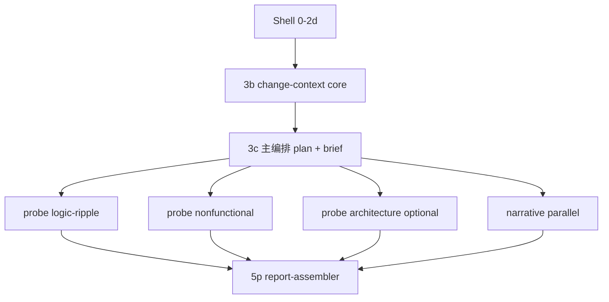

# 设计文档：audit-code 问题驱动编排（主编排出题）

- 日期：2026-06-04
- 状态：已审阅（2026-06-04，用户确认 question-driven + 主编排出题）
- 范围：`plugins/audit-code`（skill `review`、agents、verify 脚本）
- 目标：**墙钟时间优先（A）**——在可接受略降盲扫召回的前提下，显著缩短 `/audit-code:review` 端到端耗时
- 前置：
  - `2026-06-04-review-plugin-design.md`
  - `2026-06-04-audit-code-report-quality-design.md`
  - `2026-06-04-audit-code-mechanism-dedup-design.md`

## 1. 问题陈述

当前 v1 编排为：**change-context（串行）→ 六维 analyst 并行 → finding-merger → report-writer**。实践中：

1. **重复读上下文**：六个 analyst 各自 Read `change-context.json`、扫 `review-files.json`，impact/residual 还高预算全仓 Grep。
2. **并行不等于更快**：总时间受 **最慢维度**（多为 impact + residual 双扫兄弟路径）限制。
3. **串行后段多**：merger 与 report-writer 各为一轮 sub-agent 冷启动。
4. **维度重叠**：correctness / impact / residual 在「兄弟路径、调用链」上重复劳动。

用户确认方向：**主 agent（主编排）根据 diff 与背景「出题」，再按题簇派探针**；避免多 agent 重复理解同一份代码。主编排自己出题（**不**新增 `review-planner` sub-agent）。

## 2. 目标与非目标

### 2.1 目标

1. 将默认路径从 **六维盲扫** 改为 **出题 → 探针验证 → 汇编报告**。
2. **共享理解只构建一次**：`review-brief.md` + `change-context` core；探针仅读 `question.scope`。
3. 控制 sub-agent 调用次数：典型 **3–4 次 Task**（probe 簇 ×2–3 + narrative 可选 + assembler），替代 6+2。
4. 保留终稿四节、finding schema、`defect_mechanism`、merger gate 语义（可内嵌 assembler）。
5. 提供 **`REVIEW_DEPTH=full`** 加深审查档位。

### 2.2 非目标

- 不跑测试；不改「只读、stdout only」。
- v1 不引入多轮辩驳（`REVIEW_ENABLE_CHALLENGE` 仍预留）。
- 不在本阶段实现 Shell 外的重型静态分析依赖（`hunk-index` 用 git + 轻量启发式即可；codegraph 为可选增强）。

## 3. 方案选择

曾评估：

| 方案 | 摘要 | 结论 |
|------|------|------|
| 仅 triage 跳过维度 | 改动小 | 大 PR 仍慢，未解决重复读 |
| 合并六维 agent | 减轮次 | 单 agent 易变「小六维」 |
| Fast/Full 两档 | 默认快 | 与 B/C 组合使用 |
| **问题驱动 + 主编排出题** | 主线程写 plan，探针按 scope 作答 | **采用（本文）** |

合并 **triage（方案 1）** + **探针 worker 按 kind 聚簇（方案 2 执行层）** + **主编排出题（无 planner agent）**。

## 4. 架构概览

```text
阶段 0–2b   Shell：scope, diff, review-files（不变）
阶段 2c     triage → review-profile.json
阶段 2d     Shell → hunk-index.json
阶段 3b     change-context core（轻量 sub-agent 或主编排）
阶段 3c     主编排：review-brief.md + investigation-plan.json
阶段 4′     并行：probe-worker ×2–3  ∥  narrative-writer（补 pr_narrative）
阶段 5′     report-assembler（merge gate + 四节 Markdown）
```



## 5. 角色与边界

| 角色 | 执行者 | 输入 | 输出 | 禁止 |
|------|--------|------|------|------|
| 主编排 | SKILL 主线程 | scope, review-files, hunk-index, profile, core context | plan, brief, 委派, stdout | 全仓六维盲扫；重复写 finding |
| context-core | 主编排或 1× sub-agent | diff 摘要, 入口文件 | `change-context.json`（core 字段） | finding |
| 主编排 3c | 主线程 | core + hunk-index + profile | `investigation-plan.json`, `review-brief.md` | 读全文 patch（用 hunk-index） |
| probe-worker | 1 Task / 题簇 | brief + 本簇 questions | `findings/probes/<cluster>.json` | 扩 scope；全表扫 review-files |
| narrative-writer | 1 Task（可选） | core, snapshot, diff 摘要 | 补全 `pr_narrative` | finding |
| report-assembler | 1 Task | probes + core + narrative | Markdown（回主线程） | 重新分析代码 |

### 5.1 主编排（3c）出题职责

1. 阅读 `change-context` core、`review-profile`、`hunk-index`（不读完整 `raw-diff.patch`）。
2. 生成 **8–15 条** `questions[]`（`fast` 仅 `priority=must`；`full` 含 `should`）。
3. 注入 **模板种子题**（§7），保证 `questions.length ≥ 3`。
4. 按 `kind` **聚簇**为 2–3 个 `clusters[]`，每簇 3–5 题。
5. 撰写 `review-brief.md`（≤2KB，§6.2）。

### 5.2 probe-worker 契约

- **必读**：`review-brief.md`、本簇 `questions[]`。
- **Read ≤ 12**，**Grep ≤ 15**（`residual` 相关题簇 Grep ≤ 25，且 Grep 路径前缀受 `scope` / `sibling_prefix` 限制）。
- **禁止**：Read `review-files` 全表；无 `scope` 的全仓 Grep（除 residual 簇且 profile 启用）。
- 每题输出 `verdict`: `confirmed` | `refuted` | `inconclusive`；`confirmed` 时附 1 条 finding（schema 同 `correctness-analyst`）。
- **Write 仅** `findings/probes/<cluster-id>.json`。

### 5.3 report-assembler

- 读取所有 `findings/probes/*.json`，扁平化为 `items[]`。
- 应用现有 merger gate（`meta_scope_not_a_defect`, `out_of_scope_style`, `vague_no_mechanism`, `duplicate_cluster`, performance 封顶 P3 等）；可复用 `finding-merger.md` 规则文本，**不强制**独立 merger Task。
- 按 `report-writer` 四节模板输出；§1 使用完整 `pr_narrative`（含用户侧/软件侧 + 顶层调用链）。

## 6. 共享产物

### 6.1 目录布局

```text
$REVIEW_TMP/
  scope.json
  review-files.json
  review-profile.json
  hunk-index.json
  change-context.json
  review-brief.md
  investigation-plan.json
  findings/probes/*.json
  findings/merged.json          # assembler 可选写入
  findings/rejected.json        # 可选
```

### 6.2 `review-brief.md`（固定结构）

1. **审查范围**（一行，来自 scope）
2. **stated_intent** + **change_kind**
3. **top_level_call_chain**（简版，≤6 句，可 cite path:symbol）
4. **changed_symbols**（file → symbols[]）
5. **risks_to_watch**（来自 triage + diff 启发）

探针**不得**再读 README / 全量 patch；仅当 brief 声明 hunk 不全且本题 `scope` 含该文件时，可 Read 该文件局部。

### 6.3 `hunk-index.json`（Shell 生成）

由主编排 Shell 在阶段 2d 写入，示例：

```json
{
  "version": 1,
  "files": [
    {
      "path": "pkg/foo/status.go",
      "lines_added": 12,
      "lines_removed": 4,
      "symbols_touched": ["mergeStatusConditions", "pruneRouteParentStatuses"],
      "hunk_summary": "…最多 80 行/文件…"
    }
  ]
}
```

实现：`git diff` 解析 + 可选 `rg` 符号名；不引入新二进制依赖。

### 6.4 `review-profile.json`（triage）

```json
{
  "version": 1,
  "depth": "fast",
  "skip_kinds": ["performance"],
  "enable_architecture": false,
  "enable_residual": true,
  "enable_security": true,
  "rationale": "bugfix, 8 files, touches controller"
}
```

| 画像 | 典型 skip / 开关 |
|------|------------------|
| `docs_only` | skip performance, security（可选）, residual |
| `tiny_diff`（如 &lt;3 文件且 &lt;80 行） | skip architecture, performance |
| 非 bugfix | `enable_residual: false` |
| 无 auth/http/input 触点 | `enable_security: false` |

环境变量覆盖：`REVIEW_DEPTH=full` 强制启用 should 题与 architecture。

## 7. `investigation-plan.json` schema

根因聚合与 `manifestations[]` 见 `2026-06-04-audit-code-root-cause-manifestations-design.md`。

```json
{
  "version": 1,
  "depth": "fast",
  "root_causes": [
    {
      "key": "parentref-pointer-semantic-compare",
      "summary": "ParentReference 指针字段语义比较失效",
      "grep_tokens": ["ParentReference", "slices.Contains", "DeepEqual"]
    }
  ],
  "clusters": [
    {
      "id": "logic-1",
      "worker": "logic-ripple",
      "questions": [
        {
          "id": "Q-001",
          "kind": "correctness",
          "priority": "must",
          "hypothesis": "…可证伪的一句话…",
          "root_cause_key": "parentref-pointer-semantic-compare",
          "scopes": ["pkg/foo/", "pkg/bar/status.go"],
          "scope": ["pkg/foo.go:120-200"],
          "entry_ref": "Reconcile → setHTTPRouteStatuses",
          "template": "semantic_compare",
          "grep_tokens": ["ParentReference", "DeepEqual"],
          "sibling_prefix": null
        }
      ]
    }
  ]
}
```

### 7.1 `kind` 与 worker 路由

| kind | worker | 说明 |
|------|--------|------|
| `correctness` | logic-ripple | 逻辑/边界/语义 |
| `ripple` | logic-ripple | 改动波及 call site / 兄弟 handler |
| `residual` | logic-ripple | 同修复 pattern 未修（仅 `enable_residual`） |
| `security` | nonfunctional | 鉴权/注入/密钥 |
| `performance` | nonfunctional | 热路径/复杂度 |
| `architecture` | architecture | 模块边界（仅 `enable_architecture`） |

### 7.2 模板种子（自动注入 `must`）

| template | 条件 |
|----------|------|
| `residual_peer_pattern` | `change_kind=bugfix` 且 `enable_residual` |
| `security_surface` | hunk-index 含 http/auth/token/Validate 等 |
| `performance_hotpath` | 含 loop/Query/批量/嵌套循环启发 |
| `architecture_boundary` | 多包或 exported API 变更 |
| `docs_sanity` | `docs_only`：是否误改非文档产物 |

主编排可追加启发式题；**不得删除**已注入的 `must` 种子题。

### 7.3 聚簇规则

- 每 **worker** 一 Task；每 Task **3–5** 题。
- 典型：`logic-ripple`（correctness + ripple + residual）、`nonfunctional`（security + performance）、`architecture`（可选）。
- `fast`：最多 **3** 个 probe Task；`full`：可达 3–4。

## 8. probe 输出 schema

```json
{
  "version": 1,
  "cluster_id": "logic-1",
  "worker": "logic-ripple",
  "answers": [
    {
      "question_id": "Q-001",
      "verdict": "confirmed",
      "finding": { }
    },
    {
      "question_id": "Q-002",
      "verdict": "refuted"
    }
  ],
  "items": []
}
```

`items[]` 为扁平 finding 列表（与现 dimension JSON 兼容），供 assembler 消费。Finding 字段要求不变：`issue_origin`, `reachability`, `location.symbol`, `trigger.scenario`, P0–P2 的 `trigger.defect_mechanism`, `finding_category` 等。

## 9. SKILL 阶段变更摘要

| 阶段 | v1 | v2（本设计） |
|------|-----|----------------|
| 2c | — | triage → `review-profile.json` |
| 2d | — | `hunk-index.json` |
| 3b | change-context 含完整 narrative | **core** 优先；narrative 可后补 |
| 3c | — | **主编排** plan + brief |
| 4 | 六维并行 | probe 簇并行 + narrative |
| 5–6 | merger + report-writer | **report-assembler** 合一 |

### 9.1 主编排 3c prompt 要点（SKILL 内嵌）

- 输入路径列表：`hunk-index`, `change-context`, `review-profile`, `pr-snapshot`（可选）
- 输出：`investigation-plan.json`, `review-brief.md`
- 校验：`clusters` 非空；`must` 题 ≥3；每题 `scope` 非空
- 失败回退：若出题不足，合并 **标准题包**（5×must，scope 来自 hunk-index 前 3 文件）

## 10. 兼容与迁移

| 开关 | 行为 |
|------|------|
| 默认 | question-driven 路径 |
| `REVIEW_DEPTH=full` | `should` 题 + architecture + 更高 Grep 上限 |
插件仅保留 4 个 agent：`change-context-analyst`、`narrative-writer`、`probe-worker`、`report-assembler`（finding schema 与 merger gate 内嵌于后两者）。

## 11. 验收标准

1. **墙钟**：小 PR（&lt;5 文件）在同仓库试跑，端到端时间较 v1 六维路径 **下降 ≥30%**（人工记录 3 次中位数）。
2. **调用次数**：默认路径 sub-agent **≤5**（含 assembler；不含 narrative 时 ≤4）。
3. **重复读**：probe prompt 审计 — 无「先 Read 全部 review-files」类指令；assembler 不 Read 源码。
4. **质量**：P0–P2 仍含 **根因原理**；§1 仍含顶层调用链 + 用户侧/软件侧；`REVIEW_RESULT` 语义不变。
5. **verify**：`scripts/verify-audit-code-plugin.sh` 增加对 `investigation-plan`、`review-brief`、`probe`、`REVIEW_LEGACY` 分支的检查。

## 12. 风险与缓解

| 风险 | 缓解 |
|------|------|
| 主编排漏题 | 模板种子 + 标准题包回退 |
| 出题过宽 | 每题必填 `scope`；assembler 拒 scope 外 cite |
| Task 过多 | 按簇合并，目标 3–4 Task |
| 大 PR 主编排 context 爆 | 仅读 hunk-index；brief ≤2KB |
| 召回下降 | `REVIEW_DEPTH=full`；主编排标准题包回退 |

## 13. 实现计划（下一步）

用户审阅本文档后，使用 **writing-plans** 技能生成 `docs/superpowers/plans/2026-06-04-audit-code-question-driven-implementation.md`，任务包括：SKILL 阶段重写、新增/改造 agent、Shell hunk-index、triage 规则、verify 脚本、installation 文档更新。
