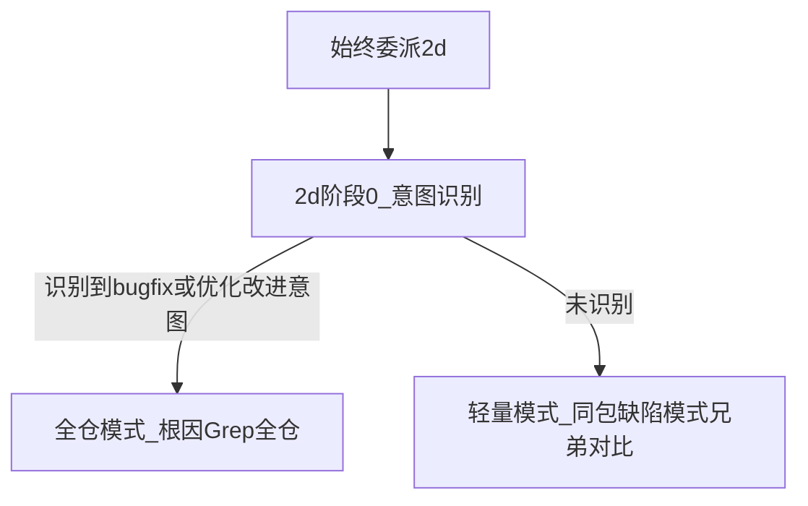

# audit review 2d 始终委派 & 内部双模式扫描设计

**日期：** 2026-06-08  
**状态：** 待实施  
**插件：** `plugins/audit`（skill：`review`）

---

## 背景

[`plugins/audit/skills/review/SKILL.md`](../../plugins/audit/skills/review/SKILL.md) 当前由阶段 1「变更性质」门控 2d 委派：仅当含 `bugfix` 或任意 `optimization/<子标签>` 时并行委派 2d，否则仅 3 个 Task（2a/2b/2c）。

实践中阶段 1 标签易偏（例如补校验、隐性 bugfix 被标为纯 `feature`），导致 2d 整条链路被跳过，全仓同类残留漏扫。该问题在测试与真实 PR 审阅中反复出现。

历史方案（`residue_scan`、按标签委派）均将「是否派 2d」决策前置到阶段 1，无法根治标签偏差带来的漏委派。

---

## 目标

1. **2d 始终委派**：阶段 2 固定并行 4 个 Task（2a / 2b / 2c / 2d），与 2a/2b/2c 一致。
2. **2d 内部自决工作模式**：2d 从可审 diff 自行识别 bug 修复意图与优化改进意图，选择**全仓模式**或**轻量模式**。
3. **轻量模式有明确职责**：无意图时在同包/模块内做「可泛化缺陷模式」兄弟对比，不 skip、不全仓 Grep。
4. **阶段 1 标签仅用于报告**：变更性质 taxonomy 保留，不再门控 2d。

---

## 非目标

- 不改变 2a / 2b / 2c 职责与并行 HARD-GATE（同一轮回复内发起全部 Task）。
- 不将轻量模式并入 2b（2b 仍负责调用链与一层上下游；2d 轻量负责同包缺陷模式对等）。
- 不改变缺陷成立条件、E1/R1/T3–T4、质检与最终报告格式。
- 不因始终委派 2d 而放宽 finding 标准（轻量/全仓均须满足同类残留或缺陷成立条件）。
- v1 只改 `SKILL.md`（及必要时 `plugin.json` 版本/描述）；不新增 `agents/*.md`。

---

## 已确认决策（brainstorming）

| 项 | 选择 |
|----|------|
| 2d 委派 | **始终**与 2a/2b/2c 并行 |
| 门控移除 | 阶段 1 标签不再决定是否派 2d |
| 无意图时行为 | **轻量模式**（选项 B）：同包/模块缺陷模式兄弟对比 |
| 轻量 vs 2b 边界 | **选项 A**：2b=调用链视角；2d 轻量=可泛化缺陷模式对等，不追 caller |
| 有意图时行为 | **全仓模式**：沿用现有 2d 阶段 A/B 全仓 Grep 流程 |

---

## 总体流程

```text
阶段 0 变更预处理
→ 阶段 1 变更意图分析（标签仅报告，不门控 2d）
→ 阶段 2 始终并行：2a + 2b + 2c + 2d
    └─ 2d 内部：
        阶段 0' 意图识别 → 全仓模式 | 轻量模式
        阶段 A/B（按模式执行）
→ 主编排合并 + 覆盖说明门禁
→ 阶段 3 质检 → 阶段 4 报告
```



---

## 编排层变更（主编排）

### 委派规则（新）

| 子阶段 | 委派条件 |
|--------|----------|
| 2a | 始终 |
| 2b | 始终 |
| 2c | 始终 |
| 2d | **始终** |

- 阶段 2 **固定**在同一轮 assistant 回复内发起 **4** 个 `Task`。
- 删除「含 bugfix 或 optimization → 4 Task，否则 3 Task」分支。
- 文首流程概述、总体流程图、委派前准备、阶段 2 自检、子阶段表同步更新。

### 阶段 1 变更

- **保留** `## 变更性质与 2d 委派` 中的 taxonomy 表（节标题可改为 `## 变更性质`）。
- **删除** `### 2d 委派规则` 整节（或替换为一句：「2d 始终委派；工作模式由 2d 自决，见 2d 阶段 0'」）。
- **删除** 限制条款中「仅含 bugfix 或 optimization 时委派 2d」表述。
- 阶段 1 输出模板**不变**（仍输出变更性质列表，供报告引用）。

---

## 2d 内部工作流（重写触发 + 新增阶段 0'）

### 触发（新）

**触发：** 始终由主编排委派；**不得**因阶段 1 变更性质不含 bugfix/optimization 而跳过。

### 阶段 0' — 意图识别（新增，必做）

从**可审 diff**（主依据）+ 阶段 1「变更声称」（参考，非决定性）识别：

**bug 修复意图信号（满足任一）：**
- 补上缺失的条件判断、分支、边界处理
- 补上或修正错误处理、资源清理、rollback
- 纠正 API / 库 / 框架误用
- 修正错误的默认值、配置解析、schema 处理
- 补上状态机 / enum / mode 分支
- 补上 nil / 空值 / 越界 / 生命周期 / 并发保护
- 补上权限、认证、校验

**优化改进意图信号（满足任一，且 diff 有行为变化）：**
- 正确性 / 健壮性 / 安全性改进（`optimization/correctness` 类）
- 体验 / 交互 / 可观测性改进（`optimization/ux` 类，**非**纯文案/注释）
- 与兄弟实现或约定对齐的行为调整（`optimization/consistency` 类）

**不视为优化改进意图（倾向轻量模式）：**
- 纯 rename / 纯提取函数 / 纯新增 API 骨架（无修复或防护模式）
- 纯 performance 改动（缓存、算法）且未触及上述缺陷模式
- 纯文案、注释、日志措辞（无行为变化）

**判定：**
- 识别到 **任一** bug 修复意图 **或** 优化改进意图 → **全仓模式**
- 均未识别 → **轻量模式**

须在「扫描覆盖说明」必填：
- `2d 工作模式`：`全仓` | `轻量`
- `意图识别结论`：一句话（列出识别到的信号，或说明为何无意图）

### 全仓模式（沿用现有阶段 A/B）

与现网 2d 一致：
1. 从 diff + 阶段 1 变更声称提取根因模式
2. 生成 3～8 条（可扩展至 15 条）搜索模式
3. 全工程 Grep（排除 vendor/test/docs 等）
4. 候选逐项核实，仅输出满足同类残留成立条件的 finding

覆盖说明门禁不变（根因模式、搜索模式清单、候选清单、核实结果）。

### 轻量模式（新增）

当阶段 0' 判定为轻量模式时执行：

**范围：** 变更锚点所在**包 / 模块**（同 Go package、同 Python module、同 TS 目录层级等）；**不**追 caller，**不**全仓 Grep。

**步骤：**

1. **提取缺陷模式（1～3 条）**：从 diff 尝试提取可泛化模式（若有弱信号）；若 diff 为纯新增/纯 rename 无可提取模式，须在覆盖说明注明并仍完成步骤 3 的「无对等业务单元」记录。
2. **定位同包并行实现**：同文件、同包、同 struct/class 的兄弟方法，或同业务模式并行函数（与 2b 兄弟对比范围类似，但**只问缺陷模式对等**，不问调用链）。
3. **对等核实**：对每个并行实现检查是否缺少与本次变更对等的防护（校验、错误处理、nil 检查等）。
4. **输出**：仅当满足「同类残留缺陷」成立条件时输出 finding；否则在核实表中记录 skip 原因。

**轻量模式不得：**
- 以「无意图」为由空白返回（须完成覆盖说明）
- 将性能建议、风格不一致、命名问题作为 finding
- 做全仓 Grep

### 聚焦不变（全仓 + 轻量均适用）

- 只审查缺陷性质第 3 类（仓库中其他代码的同类残留缺陷），或轻量模式下同包兄弟缺失对等防护且构成真实缺陷
- 不得将性能改进点、体验建议、风格不一致作为 finding
- 不因代码形态相似就泛化为残留，必须证明同根因（全仓）或同等缺陷模式缺失（轻量）、同触发、同后果

---

## 2b 与 2d 边界

| 维度 | 2b | 2d 轻量 | 2d 全仓 |
|------|-----|---------|---------|
| 视角 | 调用链 + 一层上下游 | 同包缺陷模式对等 | 同根因全仓残留 |
| 核心问题 | 上下游是否因本次变更出问题？ | 兄弟实现是否缺同等防护？ | 仓库别处是否还有同类 bug？ |
| 是否追 caller | 是（R1） | 否 | 否（Grep 定位） |
| 范围 | 一层 + 按需扩展 | 同包/模块 | 全工程 |

合并规则不变：2b 兄弟对比与 2d 命中同落点 → 合并为一条，保留最全证据。

---

## 覆盖说明门禁（主编排，2d 部分更新）

2d「扫描覆盖说明」**必填**（始终检查，因 2d 始终委派）：

- [ ] `2d 工作模式` 已标注（全仓 / 轻量）
- [ ] `意图识别结论` 已填写
- [ ] **全仓模式**：根因模式、搜索模式清单、候选清单、核实结果（沿用现门禁）
- [ ] **轻量模式**：同包/模块范围已说明；缺陷模式（1～3 条）已列出或注明无可提取；兄弟对比清单已生成；逐项核实或 skip 原因已记录

删除「未委派 2d → 不检查 2d 覆盖说明」条款。

---

## 行为变化对照

| PR | 阶段 1 标签（可能标错） | 现网 | 新规则 |
|----|------------------------|------|--------|
| 补校验，标成 feature | feature | 不派 2d | 始终派 2d → 识别意图 → **全仓** |
| 纯新增 API | feature | 不派 2d | 始终派 2d → 无意图 → **轻量** |
| 修 nil panic | bugfix | 派 2d 全仓 | 始终派 2d → **全仓** |
| 同包 rename | refactor | 不派 2d | 始终派 2d → **轻量**（可能无可对比模式） |
| 优化文案 only | optimization/ux | 派 2d | 始终派 2d → 倾向**轻量**（无行为变化信号） |

---

## 实施范围

| 文件 | 变更 |
|------|------|
| `plugins/audit/skills/review/SKILL.md` | 编排始终 4 Task；2d 重写触发 + 阶段 0' + 轻量模式；阶段 1 删除 2d 门控 |
| `plugins/audit/.claude-plugin/plugin.json` | 版本 bump + description 更新 |

---

## 风险与缓解

| 风险 | 缓解 |
|------|------|
| 每次固定 4 Task 增加 token | 轻量模式限制同包范围、模式 1～3 条；无意图时禁止全仓 Grep |
| 2d 轻量与 2b 兄弟对比重叠 | 文档明确分工：2b=调用链，2d 轻量=缺陷模式对等 |
| 2d 意图识别仍可能偏 | 阶段 1 声称作参考；轻量模式兜底不完全 skip |
| 纯 feature PR 也跑 2d | 轻量模式成本低；覆盖说明可论证 skip |

---

## 验收标准

1. `SKILL.md` 阶段 2 固定 4 Task，无 3 Task 分支。
2. 2d 触发段为「始终委派」，不含阶段 1 标签条件。
3. 2d 含阶段 0' 意图识别 + 全仓/轻量双模式流程。
4. 轻量模式含同包范围、缺陷模式、兄弟对比清单要求。
5. 阶段 1 不再含「2d 委派规则」门控节。
6. 2d 聚焦不变条款保留；finding 标准未放宽。
