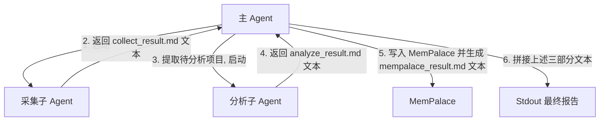

# Design Spec: GitHub Trend Skill Optimization (Markdown-based Protocol)

## 1. 背景与目标

当前 `github-trend` 技能中，步骤之间的状态与文件同步极其复杂，且在 Step 2（项目分析阶段）会为每个候选项目分别启动一个子 Agent，导致大量子 Agent 被频繁创建，消耗大且流转混乱。

本设计旨在：
1. **减少子 Agent 的创建数量**：Step 2 项目分析由**单个**分析子 Agent 串行循环处理所有候选项目。
2. **极简化状态与文件同步**：彻底废弃所有零散的中间 JSON 文件，以 Markdown 格式作为 Agent 之间的通信协议与 `debug=true` 时的磁盘存储文件。

---

## 2. 系统架构与数据流向

### 2.1 角色定义
*   **主 Agent (Parent Agent)**：整体流程调度中心。
*   **采集子 Agent (Collection Sub-agent)**：Step 1 启动一次，负责爬取 GitHub Trending 榜单并结合 MemPalace 过滤历史记录，生成 `collect_result.md` 文本。
*   **分析子 Agent (Analysis Sub-agent)**：Step 2 启动一次，传入候选 URL 列表，串行循环分析所有项目并过滤低 Star 项目，生成 `analyze_result.md` 文本。

### 2.2 数据流向图


### 2.3 物理文件落盘（仅 `debug=true` 时）
所有生成的 Markdown 文本除了在 LLM 会话中传递外，若 `debug=true`，还需写入以下路径：
*   `TMP_DIR/collect_result.md`
*   `TMP_DIR/analyze_result.md`
*   `TMP_DIR/analyze/<owner>__<repo>.md` （分析成功的单个项目报告）
*   `TMP_DIR/mempalace_result.md`

---

## 3. Markdown 协议规范

各步骤输出的 Markdown 采用固定二级标题进行划分，便于使用正则表达式进行数据提取。各步骤的“困难与统计”采用自由格式，不再强求结构化指标。

### 3.1 `collect_result.md` 协议格式
```markdown
## 待分析项目
- https://github.com/owner1/repo1
- https://github.com/owner2/repo2

## 剔除已分析项目
- https://github.com/owner3/repo3

## 采集困难与统计
（自由格式，记录网页加载、MemPalace 连通性、调用次数等）
```

### 3.2 `analyze_result.md` 协议格式
```markdown
## 分析报告

### owner1/repo1
**仓库地址**: https://github.com/owner1/repo1
**github star 数量**: 12000

#### 适用场景
（详细说明它项目适用的实际问题场景，描述必须大于 100 字）

#### 要解决的问题
（详细说明其要解决的技术问题，且必须大于 100 字）

#### 功能
（详细说明该项目的各个功能，每个功能文字至少大于 50 字）

### owner2/repo2
...

## 分析失败项目

### owner3/repo3
- **仓库地址**: https://github.com/owner3/repo3
- **github star 数量**: 6000
- **分析失败**: 页面加载超时

## 剔除 star 不足项目
- https://github.com/owner4/repo4

## 分析困难与统计
（自由格式，记录 star 数解析异常、超时重试、浏览器调用次数等）
```

### 3.3 `mempalace_result.md` 协议格式
```markdown
## 写入摘要
成功写入 MemPalace 的项目：
- https://github.com/owner1/repo1

## 写入困难与统计
（自由格式，记录成功/失败/跳过数以及任何错误）
```

---

## 4. 详细执行流程与逻辑

### 4.1 Step 0：准备与初始化
1. **获取时间**：读取本地系统当前真实时间作为生成时间。
2. **连通性校验**：确认 `/usr/sbin/agent-browser` 与 MemPalace 可用。
3. **Debug 配置**：解析 `debug` 指令参数（默认 `true`）。若为 `true`，创建 `TMP_DIR` 目录及 `TMP_DIR/analyze/` 子目录。

### 4.2 Step 1：采集子 Agent
1. 主 Agent 启动采集子 Agent，任务为：
   * 访问 `https://github.com/trending` 抓取项目 URL，并规范化为 `https://github.com/<owner>/<repo>`。
   * 调用 `mempalace_search` 对 URL 进行历史去重。
   * 格式化并返回 `collect_result.md` 的文本内容。
2. 主 Agent 接收到返回内容。若 `debug=true`，落盘至 `TMP_DIR/collect_result.md`。

### 4.3 Step 2：分析子 Agent
1. 主 Agent 通过正则（匹配 `## 待分析项目` 块中的 `- https://...` 链接）从采集文本中提取待分析 URL 列表。
2. 若列表为空，跳过 Step 2 和 Step 3，直接跳转至 Step 4 输出「今日无新项目」。
3. 否则，主 Agent 启动分析子 Agent，传入待分析 URL 列表，任务为：
   * **串行循环**处理每个项目。
   * 优先使用 `/usr/sbin/agent-browser` 提取项目主页的 Star 数。
   * **Star 门禁**：若 Star < 5000，归类到 `## 剔除 star 不足项目`；若 Star ≥ 5000，则提取 README 信息生成项目报告。若解析失败或处理异常，归类至 `## 分析失败项目`。
   * 若 `debug=true`，将分析成功的单个项目报告单独写入 `TMP_DIR/analyze/<owner>__<repo>.md`。
   * 格式化并返回 `analyze_result.md` 文本内容。
4. 主 Agent 接收到返回内容。若 `debug=true`，落盘至 `TMP_DIR/analyze_result.md`。

### 4.4 Step 3：写入历史数据库 (MemPalace)
1. 主 Agent 使用正则从 `analyze_result.md` 的 `## 分析报告` 段落中提取分析成功的项目 URL 列表。
2. 主 Agent 串行调用 `mempalace_diary_write` 写入已分析记录（不委派子 Agent）。
3. 主 Agent 格式化并生成 `mempalace_result.md` 文本。若 `debug=true`，落盘至 `TMP_DIR/mempalace_result.md`。

### 4.5 Step 4：整合输出报告
1. 主 Agent 原样提取并拼接生成最终报告输出到 stdout：
   * 日报头部，包含生成时间和统计（成功分析项目数即 `## 分析报告` 中的项目数；分析失败项目数即 `## 分析失败项目` 中的项目数；Star 不足与已分析项目不计入上述两项）。
   * `## 分析报告` 段落（来自 `analyze_result.md`）。
   * `## 分析失败项目` 段落（来自 `analyze_result.md`，若无则不输出该节）。
   * `## 剔除已分析项目`（来自 `collect_result.md`，若无则写“无”）。
   * `## 剔除 star 不足项目`（来自 `analyze_result.md`，若无则写“无”）。
   * `## 执行困难与调试统计`（直接合并拼接 `collect_result.md`、`analyze_result.md`、`mempalace_result.md` 中的“困难与统计”段落）。

---

## 5. 异常处理规范

| 异常情况 | 应对策略 |
| :--- | :--- |
| `agent-browser` 不可用 | 终止运行，并报错提示安装全路径服务。 |
| MemPalace 不可用 (Step 1) | 终止运行（因为无法进行去重过滤）。 |
| MemPalace 不可用 (Step 3) | 记录警告困难，跳过写入步骤，继续执行 Step 4。 |
| 待分析项目列表为空 | Step 4 头部显示「今日无新项目」，跳过 Step 2/3，正常输出分类剔除及困难汇总信息。 |
| 分析子 Agent 异常中断 | 主 Agent 捕获异常，将已完成部分的 Markdown 进行拼接，未完成的项目标记为分析失败。 |
